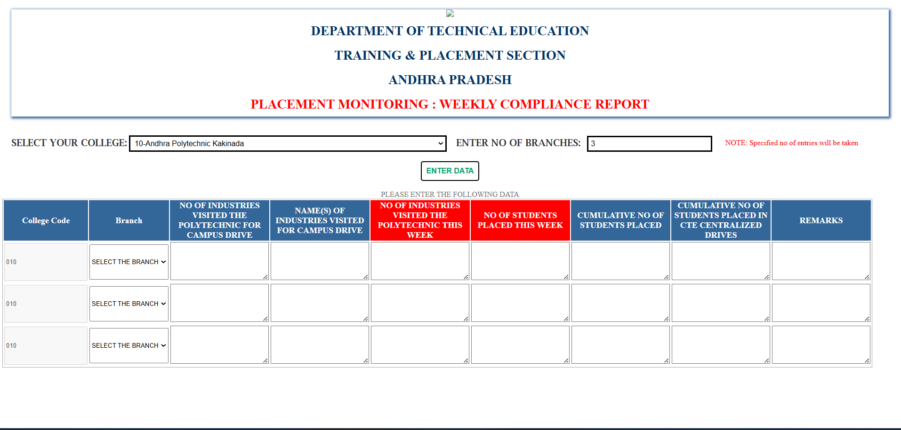

# Placement Monitoring Weekly Compliance Report

This project is a web-based form for monitoring weekly placement compliance in technical education institutions in Andhra Pradesh. It allows users to select their college, enter branch details, input placement-related data, and submit the form. The collected data is stored using Google Apps Script and can be printed for record-keeping.

## Features
✅ **College Selection** - Users can choose their college from a predefined list.
✅ **Dynamic Table Generation** - A table is generated based on user input.
✅ **Data Entry** - Users can input placement-related details such as:
   - Industries visiting for campus drives.
   - Number of students placed (weekly and cumulative).
   - Centralized drive placements and remarks.
✅ **Data Submission** - Data is sent to Google Apps Script for processing.
✅ **Print Option** - Users can print the form for official records.

## Technologies Used
- **HTML** - Structure of the webpage.
- **CSS** - Styling and layout.
- **JavaScript** - Dynamic table generation and form handling.
- **Google Apps Script** - Backend processing and data storage.

## Installation
Clone the repository:
```sh
git clone https://github.com/your-username/placement-monitoring.git
```
Navigate to the project folder:
```sh
cd placement-monitoring
```
Open `index.html` in your browser.

## Screenshots


## Future Enhancements
🚀 Implement authentication for restricted access.
🚀 Store data in a database for better tracking and analytics.
🚀 Improve UI responsiveness and user experience.

## Contributing
Feel free to fork this project and submit pull requests!

## License
This project is for educational and internal use within the Department of Technical Education, Andhra Pradesh.

